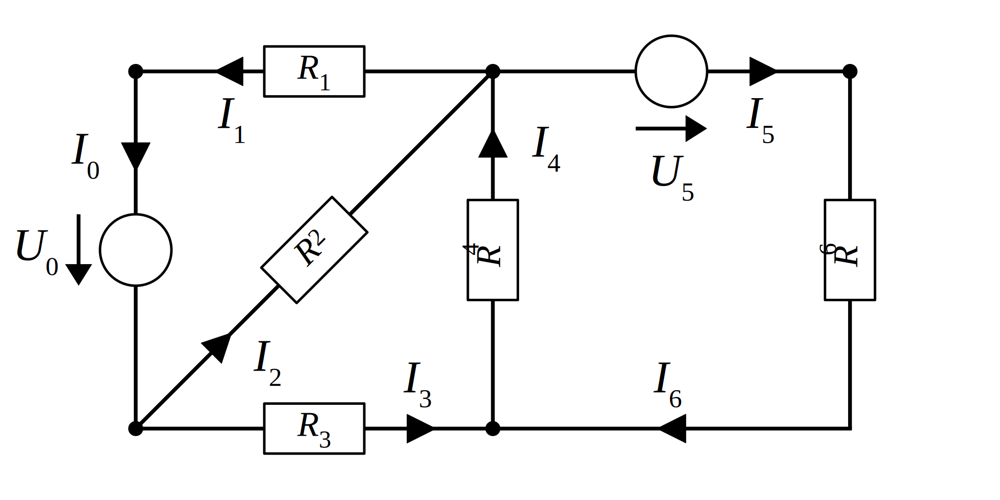
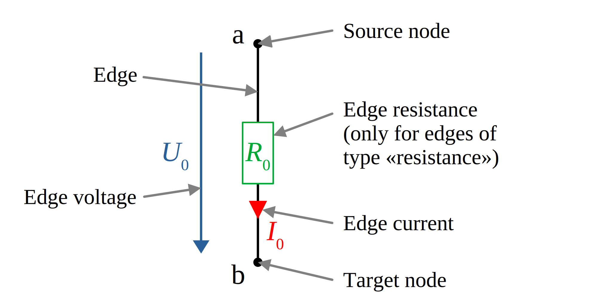

network_analysis
================

[`Network`]: https://docs.rs/network_analysis/0.2.6/network_analysis/network/struct.Network.html
[`EdgeListEdge`]: https://docs.rs/network_analysis/0.2.6/network_analysis/network/struct.EdgeListEdge.html
[`NodeEdge`]: https://docs.rs/network_analysis/0.2.6/network_analysis/network/struct.NodeEdge.html
[`new`]: https://docs.rs/network_analysis/0.2.6/network_analysis/shared/trait.NetworkAnalysis.html#tymethod.new
[`solve`]: https://docs.rs/network_analysis/0.2.6/network_analysis/shared/trait.NetworkAnalysis.html#tymethod.solve
[`MeshAnalysis`]: https://docs.rs/network_analysis/0.2.6/network_analysis/mesh_analysis/struct.MeshAnalysis.html
[`NodalAnalysis`]: https://docs.rs/network_analysis/0.2.6/network_analysis/nodal_analysis/struct.NodalAnalysis.html
[`CurrentSources`]: https://docs.rs/network_analysis/0.2.6/network_analysis/shared/type.CurrentSources.html
[`VoltageSources`]: https://docs.rs/network_analysis/0.2.6/network_analysis/shared/type.VoltageSources.html
[`Resistances`]: https://docs.rs/network_analysis/0.2.6/network_analysis/shared/type.Resistances.html
[`JacobianData`]: https://docs.rs/network_analysis/0.2.6/network_analysis/shared/struct.JacobianData.html
[`Solution`]: https://docs.rs/network_analysis/0.2.6/network_analysis/shared/struct.Solution.html
[`SolverConfig`]: https://docs.rs/network_analysis/0.2.6/network_analysis/shared/struct.SolverConfig.html
[`Type`]: https://docs.rs/network_analysis/0.2.6/network_analysis/network/enum.Type.html

# Introduction

This crate allows calculating the electrical currents and voltages of planar
electrical circuits (or of circuits in other physical domains following the same
laws, such as magnetic or thermal circuits) via
[network analysis](<https://en.wikipedia.org/wiki/Network_analysis_(electrical_circuits)>),
specifically [mesh analysis](<https://en.wikipedia.org/wiki/Mesh_analysis>) and
[(modified) nodal analysis](<https://en.wikipedia.org/wiki/Nodal_analysis>).

The full documentation is available at <https://docs.rs/network_analysis/0.2.6>.

As an introductory example, let's consider the following network with seven
elements ("edges"). Two of those elements are voltage sources, the rest are
resistances.



To analyze this network using the network_analysis crate, it is first described
and checked for errors (such as e.g. short circuits). Afterwards, the voltage
sources and resistances are quantified and the network is solved both via mesh
and nodal analysis. This returns a solution object which provides multiple
methods to access e.g. the edge currents, voltages and resistances.

## Linear network

In a _linear_ network, current sources, voltage sources and resistances are
constant. Such a network can be solved directly.

```rust
use network_analysis::*;
use approx; // Needed for result assertion

/*
Phase 1: Describe and check the network

There are multiple ways to describe the network, for example by defining which
resistances / edges are connected to each other, via node indices or by
providing a `UnGraph` from the `petgraph` crate. This example uses the first
approach via the `EdgeListEdge` type. The first argument to its constructor is
a vector of edge indices connected to its "source" node, the second argument is
a vector of edge indices connected to its "target" node and the last argument
specifies whether the edge has an excitation (voltage or current). The arrows
in the example image always point from source to target.
*/
let edges = [
    // High potential is at the edge source, low potential at the edge target
    EdgeListEdge::new(vec![1, 2, 4], vec![2, 3], Type::Voltage),
    EdgeListEdge::new(vec![3, 4], vec![0, 2, 4], Type::Resistance),
    // Edge 2 is parallel to edge 0
    EdgeListEdge::new(vec![0, 3], vec![0, 1, 4], Type::Resistance), 
    EdgeListEdge::new(vec![0, 2], vec![1, 4], Type::Resistance),
    EdgeListEdge::new(vec![0, 1, 2], vec![1, 3], Type::Voltage),
];

// Check if this list of edges represents a valid network
let network = Network::from_edge_list_edges(edges.as_slice()).expect("valid network");

/*
Phase 2: Specify the resistances and excitations and solve the network

There are only voltage excitations in the network. For now, let's assume that
both excitations and resistances are constant. Furthermore, the default solver
configuration is used. To solve the network, themesh analysis method is used.
The `None` in the `solve` call represent optional arguments which can be used to
speed up the solving process (such as good starting values) - they are ignored
for now.
*/

let current_exc = CurrentSources::none();

// Voltage excitation 0: 2 V, voltage excitation 4: 1 V
let voltage_src = VoltageSources::Slice(&[2.0, 0.0, 0.0, 0.0, 1.0]); 
let resistances = Resistances::Slice(&[0.0, 1.0, 2.0, 2.0, 0.0]);
let config = SolverConfig::default();

// Solve with both mesh and nodal analysis
let mut mesh_analysis = MeshAnalysis::new(&network);
let solution_mesh = mesh_analysis.solve(resistances, current_exc, voltage_src,
                                        None, None, None, &config).expect("solvable");

let mut nodal_analysis = NodalAnalysis::new(&network);
let solution_nodal = nodal_analysis.solve(resistances, current_exc, voltage_src,
                                          None, None, None, &config).expect("solvable");

/*
Phase 3: Analyze the results

The returned `solution` object can be queried for different properties, such as
e.g. the current through the resistances / edges.
*/

// Both methods produce the same result
for solution in [solution_mesh, solution_nodal].into_iter() {
    let c = solution.currents().to_vec();
    // As expected, the current goes from target to source
    approx::assert_abs_diff_eq!(c[0], -1.5, epsilon = 1e-3); 
    approx::assert_abs_diff_eq!(c[1], -1.0, epsilon = 1e-3);
    approx::assert_abs_diff_eq!(c[2], -1.0, epsilon = 1e-3);
    approx::assert_abs_diff_eq!(c[3], -0.5, epsilon = 1e-3);
    approx::assert_abs_diff_eq!(c[4], -0.5, epsilon = 1e-3);

    /*
    According to Kirchhoff's law, the sum of the currents going into and out of
    a node must be zero.
    0 = -i0 + i1 + i2 - i4
    0 = i0 - i2 - i3
    0 = -i1 + i3 + i4
    */
    approx::assert_abs_diff_eq!(0.0, -c[0] + c[1] + c[2] - c[4], epsilon = 1e-3); 
    approx::assert_abs_diff_eq!(0.0, c[0] - c[2] - c[3], epsilon = 1e-3); 
    approx::assert_abs_diff_eq!(0.0, -c[1] + c[3] + c[4], epsilon = 1e-3); 
}
```

## Nonlinear network

Some physical systems are _nonlinear_: The value of their network elements are
functions of other values. An example for this is are ferromagnetic resistances
(which are a function of the magnetic "current" / flux going through them).
Using the same network as before, the next example shows how to define and solve
such a problem, using both the mesh and the nodal analysis methods offered by
this crate. Under the hood, an iterative solver is used. The number of
iterations needed can be read out from the returned solution object.

```rust
use network_analysis::*;
use approx; // Needed for result assertion

let edges = [
    EdgeListEdge::new(vec![1, 2, 4], vec![2, 3], Type::Voltage),
    EdgeListEdge::new(vec![3, 4], vec![0, 2, 4], Type::Resistance),
    EdgeListEdge::new(vec![0, 3], vec![0, 1, 4], Type::Resistance),
    EdgeListEdge::new(vec![0, 2], vec![1, 4], Type::Resistance),
    EdgeListEdge::new(vec![0, 1, 2], vec![1, 3], Type::Voltage),
];

let network = Network::from_edge_list_edges(edges.as_slice()).expect("valid network");

/*
This time, the network resistances are described as a function of the currents
going through them. A simple approximation of a ferromagnetic resistance is a
function of the type k0 + k1 * (1 - exp(abs(x) * k2)), where x is the current
through the resistor. For x = 0, this function has the value k0, for x going
towards +/- infinity, this function becomes k1 + k0.
*/

let current_exc = CurrentSources::none();

// Magnetic voltage excitation 0: 2 A, magnetic voltage excitation 4: 1 A
let voltage_src = VoltageSources::Slice(&[2.0, 0.0, 0.0, 0.0, 1.0]); 
let resistances = Resistances::Function(&|mut args: FunctionArgs<'_>| {
    for (idx, res) in args.edge_value_and_type.iter_mut() {
        // k0 = 0.5; k1 = 2.0; k2 = -0.2
        *res = 0.5 + 2.0 * (1.0 - (-0.2 * (args.edge_currents[idx]).abs()).exp()); 
    }
});
let config = SolverConfig::default();

// Solve with both mesh and nodal analysis
let mut mesh_analysis = MeshAnalysis::new(&network);
let solution_mesh = mesh_analysis.solve(resistances, current_exc, voltage_src,
                                        None, None, None, &config).expect("solvable");

let mut nodal_analysis = NodalAnalysis::new(&network);
let solution_nodal = nodal_analysis.solve(resistances, current_exc, voltage_src,
                                          None, None, None, &config).expect("solvable");

// How many iterations were needed with the mesh analysis method?
assert_eq!(solution_mesh.iter_count(), 24);

// How many iterations were needed with the nodal analysis method?
assert_eq!(solution_nodal.iter_count(), 24);

// Both methods produce the same result
for solution in [solution_mesh, solution_nodal].into_iter() {
    let c = solution.currents();
    approx::assert_abs_diff_eq!(c[0], -2.919, epsilon = 1e-3);
    approx::assert_abs_diff_eq!(c[1], -1.112, epsilon = 1e-3);
    approx::assert_abs_diff_eq!(c[2], -1.807, epsilon = 1e-3);
    approx::assert_abs_diff_eq!(c[3], -1.112, epsilon = 1e-3);
    approx::assert_abs_diff_eq!(c[4], 0.0, epsilon = 1e-3);

    /*
    According to Kirchhoff's law, the sum of the currents going into and out of
    a node must be zero.
    0 = -i0 + i1 + i2 - i4
    0 = i0 - i2 - i3
    0 = -i1 + i3 + i4
    */
    approx::assert_abs_diff_eq!(0.0, -c[0] + c[1] + c[2] - c[4], epsilon = 1e-3); 
    approx::assert_abs_diff_eq!(0.0, c[0] - c[2] - c[3], epsilon = 1e-3); 
    approx::assert_abs_diff_eq!(0.0, -c[1] + c[3] + c[4], epsilon = 1e-3); 
}
```

# Nomenclature

The network analysis tools provided by this crate can be applied to multiple
domains, e.g. for electrical, thermal or magnetic networks. To simplify the
wording in the documentation, the following definitions are used:
* **Resistance _R_**: Describes the opposition of a network element to the
current. Examples: Electrical, magnetic, thermal resistance
* **Current _I_**: Describes the flow of some physical quantity between two
network nodes. Examples: Electrical current, magnetic flux, energy transfer / power
* **Voltage _U_**: Describes the potential drop over a network element.
Examples: Electrical and magnetic voltage, temperature drop

These three quantities are related to each other via $R \cdot I = U$. 

This crate uses the [petgraph](<https://docs.rs/petgraph/0.8.3/petgraph/index.html>)
crate and therefore also its terminology to describe networks:



- Node: Terminal of one end of an edge
- Edge: (Directed) connection between two nodes
- Source: Start node of an edge
- Target: Finish node of an edge

In general, the direction of all physical quantities (except resistances)
corresponds to the edge direction. In the following example, two edges share one
node `b` and a current of 5 goes through them from left to right:
```text
(a)──[0]──(b)──[1]──(c)
```
If the source of edge `0` is `b` and its target is `a`, its edge current is -5.
Likewise, if the source of edge `1` is `b` as well and its target is `c`, its
edge current is 5. If both edges have resistances with value 1, their edge
voltages are likewise -5 and 5 respectively.

Each edge has one of three [`Type`]s:
- `Type::Resistance`: The edge is a passive resistance.
- `Type::Current`: The edge is a current source.
- `Type::Voltage`: The edge is a voltage source.

# How to use this crate

Using this crate boils down to three steps:

### 1) Description of the network topology

The goal of this step is to create a valid [`Network`] which describes the
underlying circuit. This can be done creating a
[petgraph](https://docs.rs/petgraph/0.8.3/petgraph/index.html) graph first and
then converting it into a network or via simple edge structs provided by this
crate. Please see the docstring of [`Network`] for details.

### 2) Stating the problem and solving it

As shown before, this crate offers two different ways of solving a network -
mesh analysis or nodal analysis. In principle, a network can be solved with any
of the two methods, but in practice, one method can perform much better than the
other depending on the network structure. The docstrings of [`MeshAnalysis`] and
[`NodalAnalysis`] offer some guidelines when to chose which. When in doubt, it
is recommended to try both and benchmark them (e.g. by comparing the number of
iterations).

After selecting the appropriate analysis type, a [`MeshAnalysis`] /
[`NodalAnalysis`] object needs to be constructed via the [`new`] method. Then,
the behaviour of the [`CurrentSources`], [`VoltageSources`] and [`Resistances`]
need to be described as part of the call to [`solve`]. Additionally, initial
guesses for edge currents and resistances as well as custom Jacobian calculation
functions may be provided (see [`JacobianData`] for an example). The solver
behaviour can also be modified via [`SolverConfig`].

### 3) Analyzing the results

If solving the network succeeded, an [`Solution`] object is returned, which can
be queried for the currents / voltages over the edges as well as the edge
resistance values.

# Background

In general, the documentation assumes knowledge of the mesh analysis / nodal
analysis method. While the corresponding Wikipedia entries
<https://en.wikipedia.org/wiki/Mesh_analysis> and
<https://en.wikipedia.org/wiki/Nodal_analysis> provides a general overview of
the topic, it is recommended to consult specialist literature such as \[1\] to
use advanced features of this library (e.g. custom Jacobians). Additionally,
\[2\] has an in-depth walkthrough of how to iteratively solve a nonlinear
networks using mesh analysis, while
<https://lpsa.swarthmore.edu/Systems/Electrical/mna/MNA3.html>is the base of the
modified nodal analysis method used in this crate.

The principle behind both mesh and nodal analysis is to formulate a matrix
equation `A * x = b` using Kirchoffs voltage law or current law, where `A` is
the coefficient matrix formed from the resistances, `x` is the vector of
unknowns and `b` represents the excitations provided by current and voltage
sources. Using linear algebra methods, the system is then solved for `x`, from
which edge currents and voltages can be derived. If the system is linear (all
resistances and sources are static), the calculation is finished. Otherwise, the
calculated edge currents and voltages are used to recalculate the resistances
and sources. The recalculated values are then used to formulate a new matrix
equation and so on. Since this procedure is in essence a root finding problem
(`A * x - b = 0`), the [Newton-Raphson](https://en.wikipedia.org/wiki/Newton%27s_method)
algorithm is used.

# Feature flags

All features are disabled by default.

## Serialization and deserialization

The following structs can be serialized and deserialized using the [serde](https://crates.io/crates/serde) crate:
- [`EdgeListEdge`]
- [`Network`]
- [`NodeEdge`]
- [`SolverConfig`]
- [`Type`]

This functionality is gated behind the `serde` feature flag.

# Literature

1) Schmidt, Lorenz-Peter; Schaller, Gerd; Martius, Siegfried: Grundlagen der
Elektrotechnik 3 - Netzwerke. 1st edition (2006). Pearson, Munich
2) Mathis, Stefan: Permanentmagneterregte Line-Start-Antriebe in Ferrittechnik,
PhD thesis, TU Kaiserslautern, Shaker-Verlag, 2019